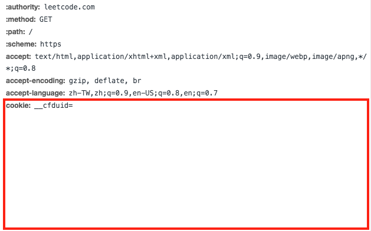

# LeetCode Downloader

Download your accepted submissions and questions from LeetCode!

## Start

```
$ yarn
$ cp config-tmpl.json config.json
```

Do the following steps to get your cookie at LeetCode
1. Open Chrome and login [leetcode.com](https://leetcode.com/).
2. Open developer tools and network tab.
3. Open one request sending to LeetCode and copy the cookie.
4. Paste it into `config.json`.



```
# fetch the latest accepted submission of each question
$ node fetchSubmission.js

# fetch the description of each 
$ node fetchQuestion.js

# merge questions and accepted submissions
$ node mergeQA.js
```

## License

MIT
